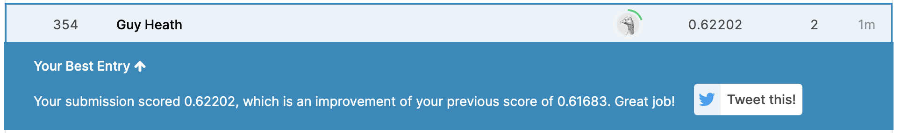

# Udacity Data Scientist Nanodegree
## Capstone Project: Arvato Financial Solutions

This repository contains files associated with my capstone project submission for the Udacity Data Scientist Nanodegree. The blog post that accompanies this can be found on [**TODO: INSERT LINK**](#LinkToBlogPost).

### Table of Contents

1. [Installation](#installation)
2. [Project Motivation](#motivation)
3. [File Descriptions](#files)
4. [Results](#results)
5. [Licensing, Authors, and Acknowledgements](#licensing)

## Installation 

This project was performed using Python 3 and the following libraries:

- numpy
- pandas
- matplotlib
- sklearn
- IPython

## Project Motivation

The objective of the project is to predict whether the recipient of an advertising campaign is likely to respond to it, and comprises three major steps:

1. **Customer Segmentation Report**  
Unsupervised learning methods (PCA, *k*-means clustering) will be used to analyse attributes of established customers and the general population in order to create customer segments.

2. **Supervised Learning Model**  
Using a third dataset with attributes from targets of a mail order campaign, the previous analysis will be used to build a machine learning model that predicts whether or not each individual will respond to the campaign. This model will be optimised via hyperparameter tuning and other methods.

3. **Kaggle Competition**  
With the optimised model, predictions will be made on the campaign data and individuals will be ranked by how likely they are to convert to being a customer. The predictions will be submitted to a Kaggle competition.

## File Descriptions 

The following files are included in this GitHub repository:

- `Arvato Project Workbook.ipynb`: Jupyter Notebook containing the data analysis
- `Arvato Project Workbook.html`: HTML version of the above notebook
- `README.md`: this file
- `kaggle_screenshot.png`: screenshot of result from submission to Kaggle competition

The following data files are NOT included, but are required to run the notebook:

- `Udacity_AZDIAS_052018.csv`
- `Udacity_CUSTOMERS_052018.csv`
- `Udacity_MAILOUT_052018_TEST.csv`
- `Udacity_MAILOUT_052018_TRAIN.csv`
- `DIAS Attributes - Values 2017.xlsx`

These files should be obtained from the Udacity workspace for this project.

## Results

Results are discussed in more detail in the [TODO: blog post](#), but in summary:

The unsupervised model identifies clusters of the population that are more likely to be customers: financially-aware people with average income, but high expenditure (high-end cars, home ownership). The columns in the dataset that relate to this are also identified.

A supervised model is built using a Logistic Regression classifier (which is found to outperform other models). It is found that model performance can be improved by using only a subset of columns: those that were found by the unsupervised model to correlate with being a customer. The model is further optimised via hyperparameter tuning.

Finally, predictions are made on a final dataset, and the results submitted to the [Kaggle competition](https://www.kaggle.com/c/udacity-arvato-identify-customers/). A score of 0.622 is achieved; this is not excellent, but is better than would be achieved with a coin toss (score of 0.5)! Possible improvements are discussed in the blog post.

## Licensing and Acknowledgements

Thank you to Arvato for the dataset, and to [Udacity](https://www.udacity.com) for the excellent Data Scientist Nanodegree programme.

This software is provided under the [MIT licence](https://opensource.org/licenses/MIT).
